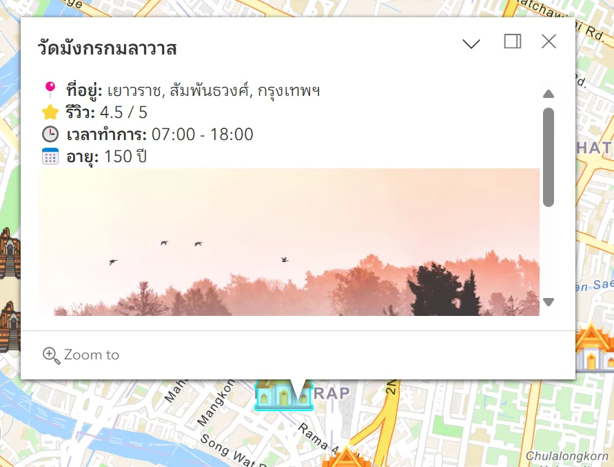
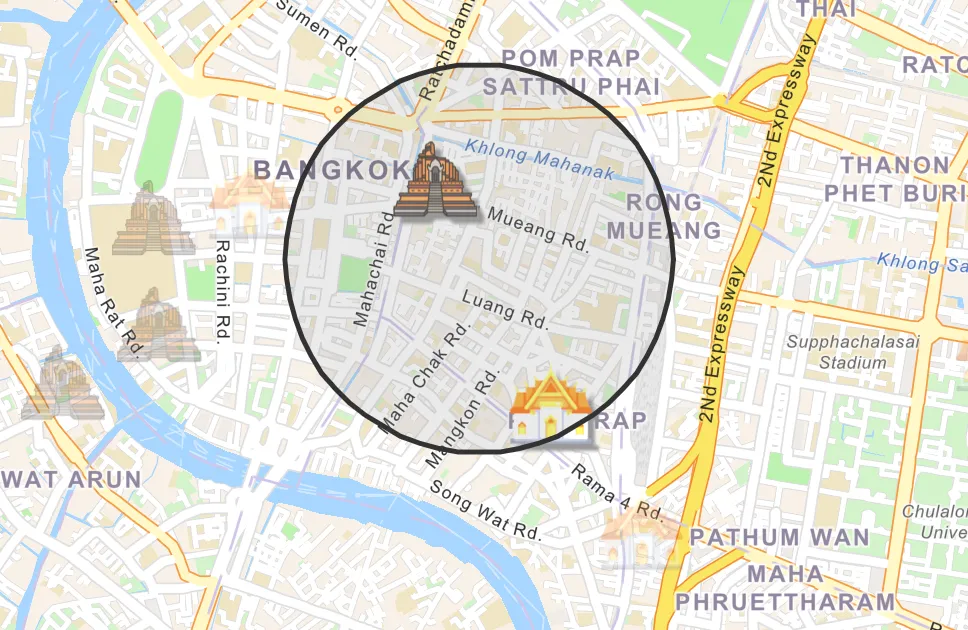
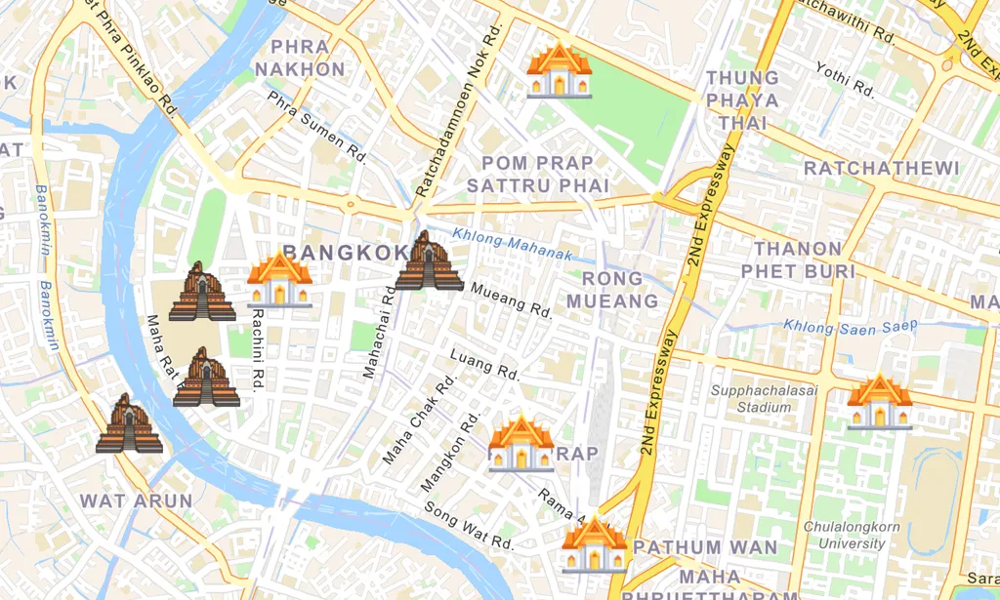
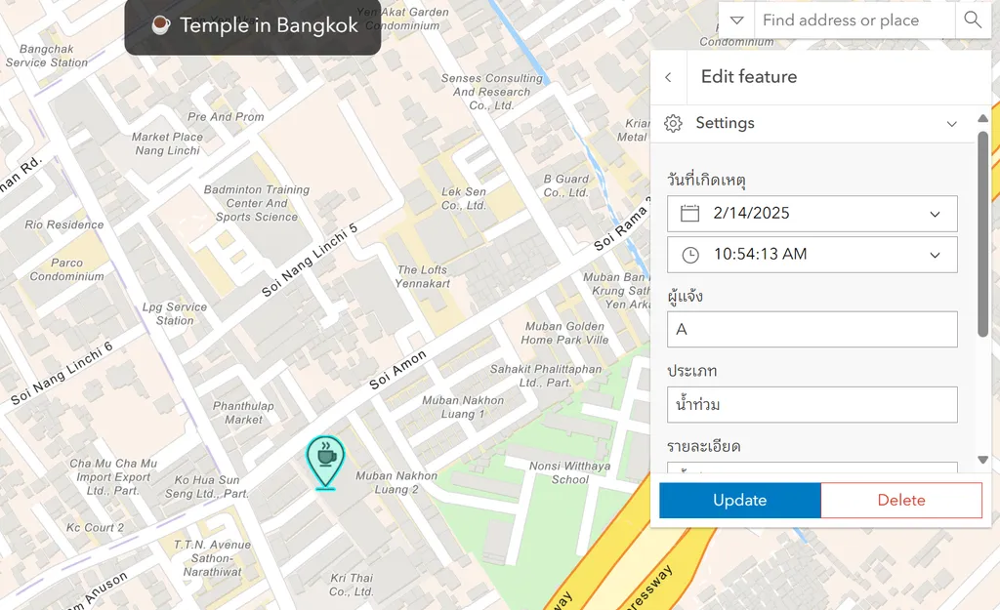
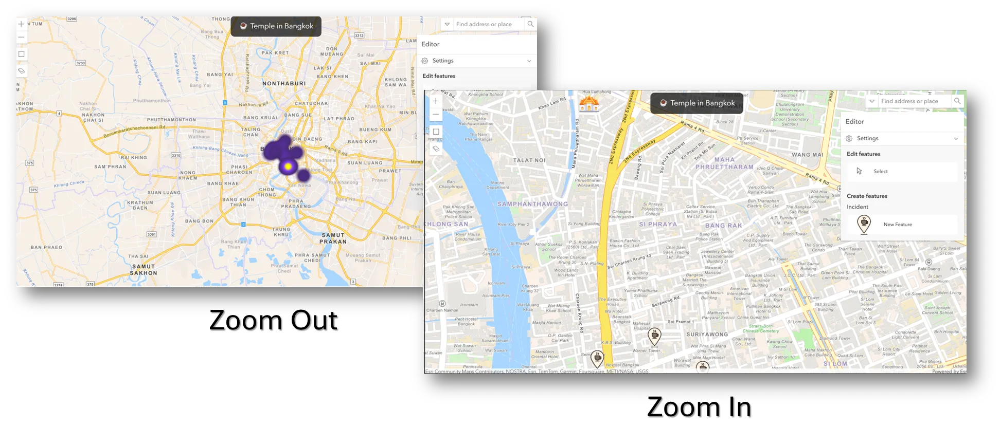

# Project Assignment (20 คะแนน) - ทำกลุ่ม 2 คน

## **โจทย์:** คิดหัวข้อที่อยากจะทำและนำมาพัฒนาเป็นเว็บแอปพลิเคชันแผนที่เชิงโต้ตอบด้วย ArcGIS JS SDK

### 🔹**เงื่อนไขและคุณสมบัติที่ต้องมี:** (คะแนนรวมทั้ง 40 คะแนน - เก็บ 20 คะแนน)

1. **สามารถแสดงแผนที่ Basemap เว็บแอปพลิเคชัน** - (2 คะแนน)
2. **มีชั้นข้อมูล (Layers)** แสดงบนแผนที่อย่างน้อย 2 ชั้น ได้แก่ (4 คะแนน)
    1. ชั้นข้อมูลประเภท **Feature Layer** เพื่อรองรับการ Add/Edit/Delete ข้อมูลได้ อย่างน้อย 1 Layer (2 คะแนน)
    2. ชั้นข้อมูลประเภท **CSV Layer** ที่นำมาแสดงเป็นข้อมูลประกอบ อย่างน้อย 1 Layer (2 คะแนน)
    3. โดยให้ **แต่ละ Layer มีจำนวนข้อมูลอย่างน้อย Layer ละ 20 records ขึ้นไป**
3. **สามารถการค้นหาข้อมูลทุก Layer** จากข้อ 2 ด้วย **Search Widget** (4 คะแนน)
4. เมื่อคลิ๊กดูข้อมูลบนแผนที่จะต้องแสดง **Popup Information** รายละเอียด Attribute ของข้อมูล โดยมีเงื่อนไขดังนี้ (2 คะแนน)
    1. จะต้องแสดง Attribute ทั่วไปอย่างน้อย 3 Attributes + **รูปภาพที่เกี่ยวข้อง**

    

5. **User จะต้องสามารถวาดกรอบ Area** ที่สนใจ และกรองให้เห็นข้อมูลเฉพาะใน Area นั้นได้ (4 คะแนน)

    

6. **ใช้ `UniqueValueRenderer` และ `ClassBreaksRenderer`** เพื่อกำหนดไอคอนที่แตกต่างกัน **อย่างน้อย 2 ชั้นข้อมูล** (ตัวอย่างเช่นทำเรื่องวัดในกรุงเทพ) (8 คะแนน)
    
    ตัวอย่าง **`ClassBreaksRenderer`**
    
    1. (Example) วัดที่มีอายุ **มากกว่า 200 ปี** → ใช้ Symbol **โบราณวัด**
    2. (Example) วัดที่มีอายุ **มากกว่า 100 ปี** → ใช้ Symbol **ทั่วไป**
    3. (Example) วัดที่อายุ **น้อยกว่า** **100 ปี** → ใช้ Symbol **วัดใหม่**

    
    
    ตัวอย่าง **`UniqueValueRenderer`**
    
    1. (Example) Building ประเภท “โรงเรียน” → ใช้ Symbol **โรงเรียน**
    2. (Example) Building ประเภท “สถานีตำรวจ” → ใช้ Symbol **สถานีตำรวจ**
    3. (Example) Building ประเภท “รถไฟฟ้า BTS” → ใช้ Symbol **รถไฟฟ้า BTS**
7. **จะต้องเพิ่มแก้ไขและลบข้อมูลจากชั้นข้อมูล Layer** ที่เป็นประเภท Feature Layer ผ่านบนเว็บแอปพลิเคชันได้เลย (8 คะแนน)

    

8. เมื่อ Zoom ออกจะต้องปรับการ Render ให้เป็น **Heatmap** เพื่อให้ User เห็นถึงการกระจุกตัวของข้อมูลได้และเมื่อ Zoom เข้ามาลึกในระดับนึงจะปรับการ Render กลับมเป็น Symbol แบบเดิม (8 คะแนน)

    

## Demo
ดูการเดโมของโปรเจกต์นี้ได้ที่: [ลิงก์](https://iamnotbibia.github.io/Project-Geo-Informatics-Application-Development/)

### **Developers:**
- Developer 1: 653380206-2 นางสาวปาริชาติ หงษ์ษา (โดนัท)
- Developer 2: 653380323-8 นางสาวมณิฐชญาณ์ ธมนันท์พงษา (เมษา)

---

### **Useful Link:**

- [**`ClassBreaksRenderer`**](https://developers.arcgis.com/javascript/latest/api-reference/esri-renderers-ClassBreaksRenderer.html#classBreakInfos)
- [**`UniqueValueRenderer`**](https://developers.arcgis.com/javascript/latest/api-reference/esri-renderers-UniqueValueRenderer.html#uniqueValueInfos)

